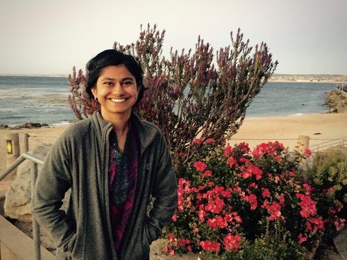

I am a graduate student at Stanford University pursuing my Ph.D. in Electrical
Engineering, advised by [Prof. Chris
Ré](http://cs.stanford.edu/people/chrismre/). I am affiliated with the
[Stanford Infolab](http://infolab.stanford.edu) and supported by the [Stanford Graduate Fellowship](https://vpge.stanford.edu/fellowships-funding/sgf/details) and the [National Science Foundation Graduate Research Fellowship](https://www.nsfgrfp.org).

My research interests primarily involve exploring practical methods for machine
learning. I currently work on a framework called Socratic learning to correct misspecified generative models via feedback from the discriminative model. Read more about it
[here](http://hazyresearch.github.io/snorkel/blog/socratic_learning.html)!

I have also worked on problems related to computational imaging. I did a
rotation with Gordon Wetzstein’s [Computational Imaging
Group](http://www.computationalimaging.org) and looked at solving 3D
deconvolution problems more efficiently. As an undergraduate at UC Berkeley, I
worked on on digital holography and phase retrieval via partial coherence
illumination in Professor Laura Waller's [Computational Imaging
Lab](http://www.laurawaller.com/).

More details in my [CV](cv.pdf) and [LinkedIn](https://www.linkedin.com/in/paromavarma) profile. 

Contact: paroma [at] stanford [dot] edu

